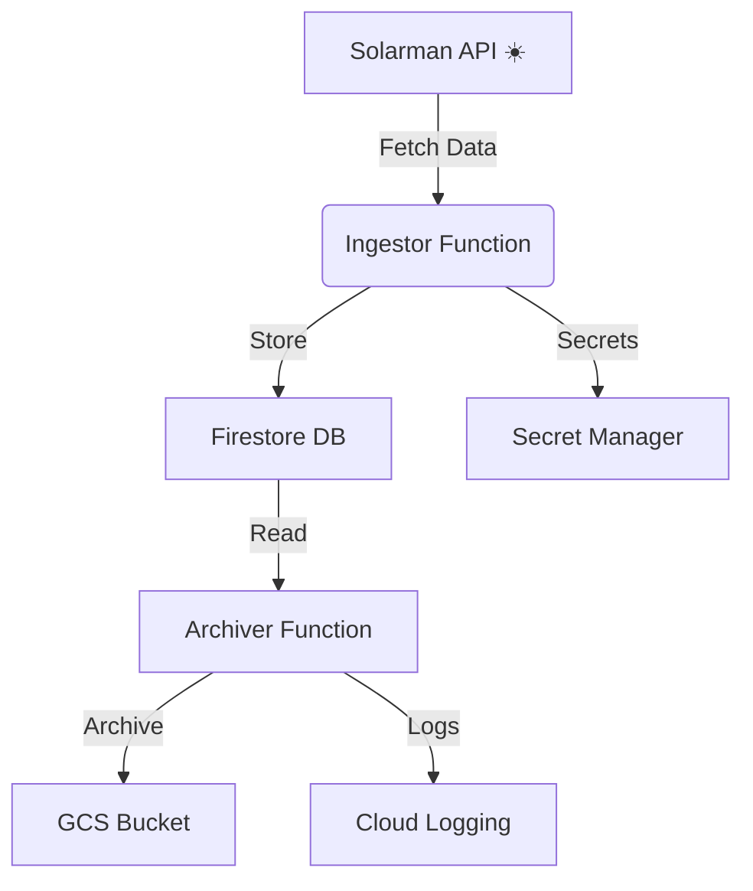

# ☀️ Solarman GCP Infrastructure

Welcome to the **Solarman GCP Infrastructure** project! This repository orchestrates a robust, cloud-native pipeline for ingesting, processing, and archiving solar energy data using Google Cloud Platform (GCP) services and modern Java microservices. 

---

## 🏗️ Architecture Overview

- **Ingestor Function**: Fetches data from Solarman API, stores
