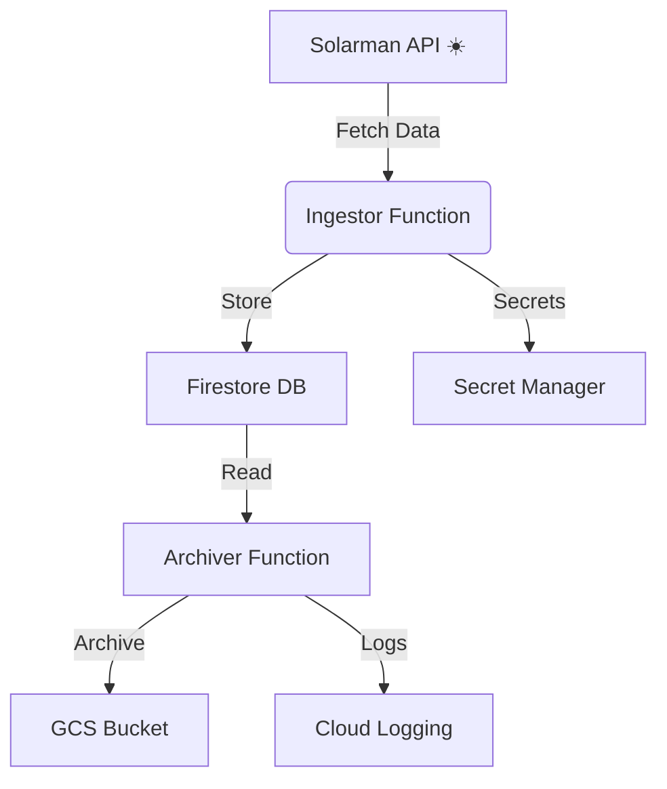

# ☀️ Solarman GCP Infrastructure

Welcome to the **Solarman GCP Infrastructure** project! This repository orchestrates a robust, cloud-native pipeline for ingesting, processing, and archiving solar energy data using Google Cloud Platform (GCP) services and modern Java microservices.

---

# 📚 Table of Contents
- [Architecture Overview](#architecture-overview)
- [Component Details](#component-details)
  - [functions/ingestor](#functionsingestor)
  - [functions/archiver-java](#functionsarchiver-java)
  - [terraform](#terraform)
- [Data Flow](#data-flow)
- [Tech Stack](#tech-stack)
- [Deployment Flow](#deployment-flow)
- [Repository Structure](#repository-structure)
- [Contributing](#contributing)
- [Contact](#contact)

---

# 🏗️ Architecture Overview



---

# 🧩 Component Details

## 📥 functions/ingestor
- **Purpose:** Ingests real-time solar data from the Solarman API.
- **Key Features:**
  - Authenticates with Solarman API using credentials from Secret Manager.
  - Fetches and validates solar readings for all configured devices.
  - Transforms and stores readings in Firestore (`solar_readings_daily`, `solar_readings_history`).
  - Emits structured logs to Google Cloud Logging.
  - Handles errors with retries and logs failures for observability.
- **Security:** Uses IAM roles for least-privilege access to GCP resources.
- **Trigger:** HTTP (Cloud Function or Cloud Run endpoint).
- **Tech:** Java 21, Spring Boot, Spring Cloud Function, Firestore, Secret Manager, OpenFeign.

## 📦 functions/archiver-java
- **Purpose:** Archives historical solar readings from Firestore to GCS for long-term retention and analytics.
- **Key Features:**
  - Periodically queries Firestore for readings older than a configurable threshold.
  - Serializes data (CSV/JSON) and writes to GCS, organized by date/device.
  - Optionally deletes or marks archived records in Firestore.
  - Emits logs to Google Cloud Logging for monitoring and auditing.
  - Idempotent archiving to avoid data loss or duplication.
- **Trigger:** Scheduled (Cloud Scheduler or Pub/Sub).
- **Tech:** Java 21, Spring Boot, Spring Cloud Function, Firestore, GCS.

## 🛠️ terraform
- **Purpose:** Provisions and manages all GCP resources required by the solution.
- **Resources Managed:**
  - Firestore (NoSQL database for solar readings)
  - GCS Buckets (for archived data)
  - Secret Manager (for API credentials)
  - IAM Roles and Service Accounts (for secure access)
  - Cloud Functions/Cloud Run (for deploying Java services)
  - Cloud Scheduler and Pub/Sub (for scheduled triggers)
- **Tech:** Terraform, Google Cloud Provider.

---

# 🔄 Data Flow

1. **Ingestor Function** is triggered (e.g., every 5 minutes):
    - Reads API credentials from Secret Manager.
    - Fetches latest readings from Solarman API for all devices.
    - Validates and transforms the data.
    - Writes readings to Firestore (collections: `solar_readings_daily`, `solar_readings_history`).
    - Logs the operation and any errors.
2. **Archiver Function** is triggered (e.g., daily):
    - Queries Firestore for readings older than a set threshold.
    - Serializes and writes the data to GCS (e.g., `gs://solar-archive/YYYY/MM/DD/device.json`).
    - Optionally deletes or marks archived records in Firestore.
    - Logs the operation and any errors.

---

# 🛠️ Tech Stack
- **Java 21**
- **Spring Boot 3.x**
- **Spring Cloud Function**
- **Google Cloud Firestore**
- **Google Cloud Storage**
- **Google Secret Manager**
- **Terraform**
- **OpenFeign** (for API integration)
- **Cloud Scheduler & Pub/Sub** (for automation)

---

# 🚀 Deployment Flow

1. **Provision Infrastructure:**
   - Use Terraform to create all required GCP resources.
2. **Deploy Functions:**
   - Build and deploy the Ingestor and Archiver Java functions to Cloud Functions or Cloud Run.
3. **Configure Schedules:**
   - Set up Cloud Scheduler to trigger the Archiver as needed.
4. **Monitor & Operate:**
   - Use GCP Logging and Monitoring for observability.

---

# 📁 Repository Structure

```text
solarman-gcp-infra/
│
├── README.md                # Project overview and architecture
├── LICENSE                  # MIT License
├── functions/
│   ├── ingestor/            # Ingestor Java Cloud Function
│   │   ├── src/
│   │   ├── build.gradle
│   │   └── ...
│   └── archiver-java/       # Archiver Java Cloud Function
│       ├── src/
│       ├── build.gradle
│       └── ...
└── terraform/               # Infrastructure as Code
    ├── main.tf
    ├── ingestor.tf
    ├── archive.tf
    └── ...
```

---

# 🤝 Contributing
Pull requests and suggestions are welcome! Please open an issue to discuss your ideas or report bugs.

---

# 📬 Contact
For questions or support, reach out to [your-email@example.com] or open an issue.

Enjoy building with ☀️ Solarman GCP Infra!
